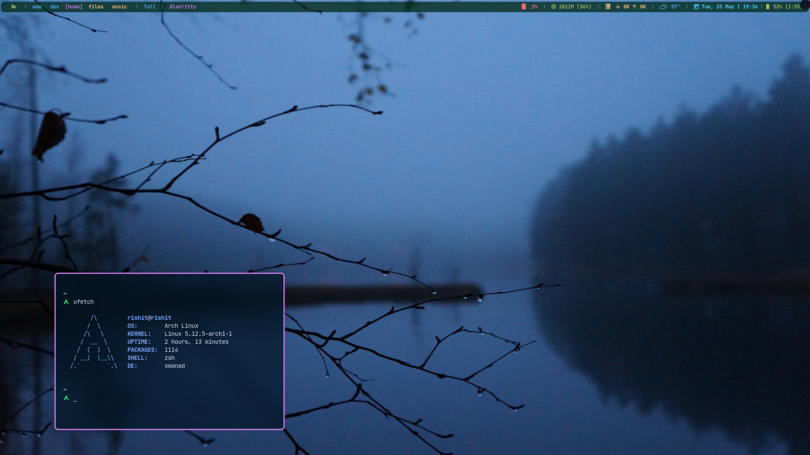

<h3>xmonad dotfiles</h3>

 

## Setup

    

## Specs
- OS → Arch Linux
- WM → XMonad
- BAR → Xmobar
- RAM → 8 GB
- MACHINE → Lenovo Legion Y530
- TERMINAL → Alacritty
- EDITOR → Vscode
- APP MENU → dmenu
- SHELL → zsh starship prompt

